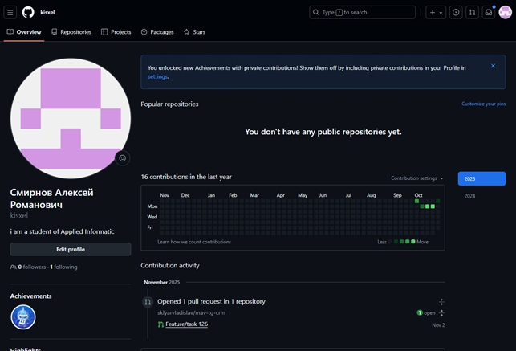
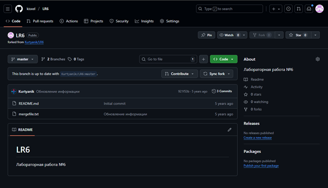

# Лабораторная работа №6
## Система контроля версий

### Цель работы
Изучение базовых возможностей системы управления версиями, получение опыта работы с Git API, опыт работы с локальным и удаленным репозиторием.

### Ход работы

#### 1. Создание аккаунта на GitHub
Создан аккаунт на сайте GitHub.

#### 2. Fork репозитория
Выполнен fork репозитория https://github.com/Kurtyanik/LR6/ в личное хранилище.

